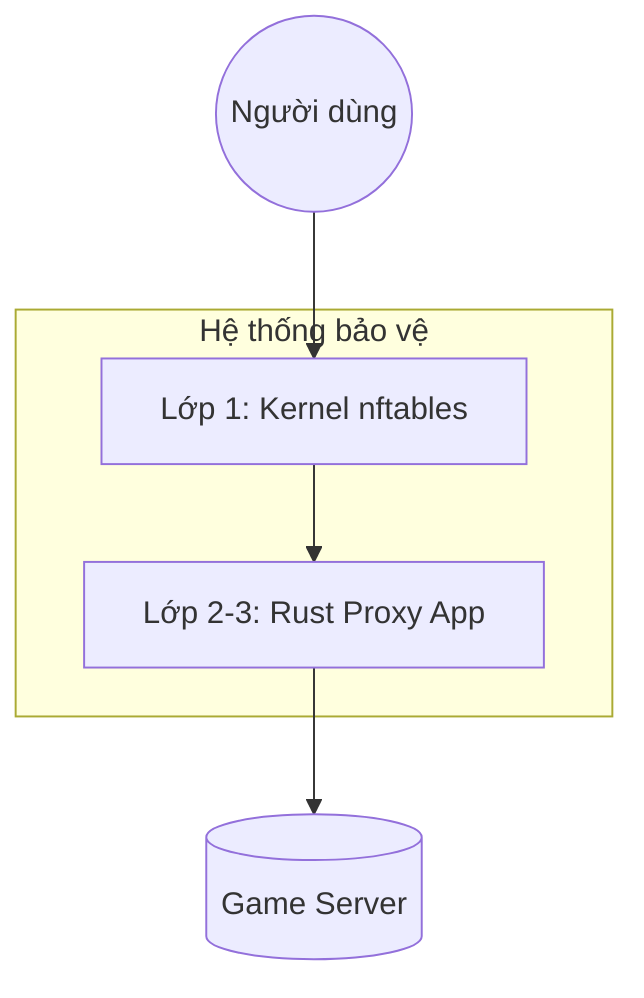

# NRO Anti-Spam TCP Proxy (Phiên bản High-Security)

Một TCP proxy hiệu suất cao, bảo mật đa tầng được viết bằng Rust, sử dụng kiến trúc Tokyo Async và tích hợp trực tiếp với nhân Linux (nftables). Phiên bản này được nâng cấp đặc biệt với khả năng lọc IP dựa trên vị trí địa lý (Geo-IP) và tên nhà cung cấp (ASN).

## Các tính năng đột phá mới

### 1. Kiến trúc phân cấp (Hierarchical Mapping)
Thay vì danh sách phẳng, hệ thống quản lý theo cụm: **Servers -> Mappings**.
- Mỗi cụm Server đại diện cho một máy chủ vật lý cụ thể.
- Cho phép cấu hình danh sách quốc gia (`allowed_countries`) chung cho cả cụm server.

### 2. Bảo vệ 3 lớp (Triple-Layer Defense)
1.  **Lớp 1 - Kernel (nftables):** Chặn IP đen ngay từ cổng vào của hệ điều hành. Tiêu tốn 0% tài nguyên xử lý ở mức ứng dụng.
2.  **Lớp 2 - Geo & ASN Filtering (MaxMind):**
    - **Geo-Blocking:** Chỉ cho phép người chơi từ các quốc gia xác định (VN, KR, JP...) truy cập.
    - **ASN Blocking:** Tự động nhận diện IP từ các nhà cung cấp Cloud/VPS (AWS, Google, DigitalOcean...) và áp dụng các chính sách giới hạn gắt gao hơn so với mạng dân dụng.
3.  **Lớp 3 - Rate Limiting & Strike:** Theo dõi hành vi kết nối theo thời gian thực để cấp thẻ phạt (Strike) hoặc cấm vĩnh viễn IP nếu có dấu hiệu spam.

---

## Kiến trúc luồng xử lý (Workflow)



---

## Cấu hình (`config.json`)

```json
{
  "servers": [
    {
      "name": "Production Server",
      "target_ip": "146.190.88.xx",
      "allowed_countries": ["VN", "KR", "JP"],
      "mappings": [
        {
          "name": "Game Port",
          "listen_addr": "0.0.0.0:14443",
          "target_port": 14443
        },
        {
          "name": "Database",
          "listen_addr": "0.0.0.0:3306",
          "target_port": 3306
        }
      ]
    }
  ],
  "geo": {
    "enabled": true,
    "datacenter_max_connects_per_minute": 5
  },
  "protection": {
    "blacklist_duration_secs": 60,
    "whitelist_after_secs": 30,
    "strikes_before_ban": 3,
    "max_syn_per_sec": 5000
  }
}
```

---

## Triển khai & Vận hành

### Yêu cầu dữ liệu Geo-IP
Để tính năng lọc quốc gia và ASN hoạt động, bạn cần đặt các file database của MaxMind vào thư mục `/opt/proxy_forward/geoip/`:
- `GeoLite2-Country.mmdb`
- `GeoLite2-ASN.mmdb`

### Lệnh quản lý quan trọng
- **Xem log thời gian thực:** `journalctl -u proxy_forward -f`
- **Xem danh sách IP bị cấm vĩnh viễn:** `cat banned_ips.txt`
- **Khởi động lại sau khi sửa cấu hình:** `systemctl restart proxy_forward`

## Giấy phép
Giấy phép MIT. Được thiết kế cho sự ổn định và bảo mật tuyệt đối của Game Server.
